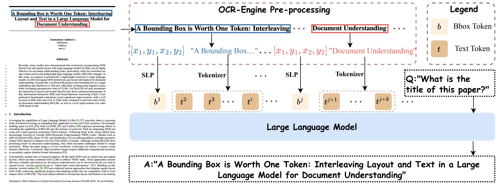

# LayTextLLM

## A Bounding Box is Worth One Token: Interleaving Layout and Text in a Large Language Model for Document Understanding

<div style='display:flex; gap: 0.25rem; '>
<a href='https://huggingface.co/LayTextLLM'></a> 
<a href='https://arxiv.org/abs/2407.01976'></a>
</div>

## 🔥 News

- **`2024.11.12`** 🌟 We're excited to release the multi-GPU compatible training and inference code for HuggingFace and Deepspeed. Explore the [Training section](#training) for more details!
- **`2024.09.09`** 🌟 Our [Attention visualization](#visualization) reveals new insights into how LayTextLLM interprets and processes layouts for enhanced document understanding.

## Introduction
LayTextLLM projects each bounding box to a single embedding and interleaves it with text, efficiently avoiding long sequence issues while leveraging autoregressive traits of LLMs. LayTextLLM not only streamlines the interaction of layout and textual data but also shows enhanced performance in Key Information Extraction (KIE) and Visual Question Answering (VQA).

## Framework

<p align="center" width="100%">
<a target="_blank"></a>
</p>


## Performance on Benchmarks

<table>
  <thead>
    <tr>
      <th rowspan="2"></th>
      <th colspan="3" style="text-align: center;"><b>Document-Oriented VQA</b></th>
      <th colspan="4" style="text-align: center;"><b>KIE</b></th>
    </tr>
    <tr>
      <th>DocVQA</th>
      <th>VisualMRC</th>
      <th>Avg</th>
      <th>FUNSD</th>
      <th>CORD</th>
      <th>SROIE</th>
      <th>Avg</th>
    </tr>
  </thead>
  <tbody>
    <tr>
      <th><b>Metric</b></th>
      <th colspan="3" style="text-align: center;"><i>ANLS % / CIDEr</i></th>
      <th colspan="4" style="text-align: center;"><i>F-score %</i></th>
    </tr>
    <tr>
      <th><b>Text</b></th>
      <td></td>
      <td></td>
      <td></td>
      <td></td>
      <td></td>
      <td></td>
      <td></td>
    </tr>
    <tr>
      <td>Llama2-7B-base</td>
      <td>34.0</td>
      <td>182.7</td>
      <td>108.3</td>
      <td>25.6</td>
      <td>51.9</td>
      <td>43.4</td>
      <td>40.3</td>
    </tr>
    <tr>
      <td>Llama2-7B-chat</td>
      <td>20.5</td>
      <td>6.3</td>
      <td>13.4</td>
      <td>23.4</td>
      <td>51.8</td>
      <td>58.6</td>
      <td>44.6</td>
    </tr>
    <tr>
      <th><b>Text + Polys</b></th>
      <td></td>
      <td></td>
      <td></td>
      <td></td>
      <td></td>
      <td></td>
      <td></td>
    </tr>
    <tr>
      <td>Llama2-7B-base<sub>coor</sub></td>
      <td>8.4</td>
      <td>3.8</td>
      <td>6.1</td>
      <td>6.0</td>
      <td>46.4</td>
      <td>34.7</td>
      <td>29.0</td>
    </tr>
    <tr>
      <td>Llama2-7B-chat<sub>coor</sub></td>
      <td>12.3</td>
      <td>28.0</td>
      <td>20.1</td>
      <td>14.4</td>
      <td>38.1</td>
      <td>50.6</td>
      <td>34.3</td>
    </tr>
    <tr>
      <td>Davinci-003-175B<sub>coor</sub></td>
      <td>-</td>
      <td>-</td>
      <td>-</td>
      <td>-</td>
      <td>92.6</td>
      <td>95.8</td>
      <td>-</td>
    </tr>
    <tr>
      <td>DocLLM~[2]</td>
      <td>69.5*</td>
      <td>264.1*</td>
      <td>166.8</td>
      <td>51.8*</td>
      <td>67.6*</td>
      <td>91.9*</td>
      <td>70.3</td>
    </tr>
    <tr style="background-color: #C8E6C9;">
      <td>LayTextLLM<sub>zero</sub> (Ours)</td>
      <td>65.5</td>
      <td>200.2</td>
      <td>132.9</td>
      <td>47.2</td>
      <td>77.2</td>
      <td>83.7</td>
      <td>69.4</td>
    </tr>
    <tr style="background-color: #C8E6C9;">
        <td>LayTextLLM<sub>vqa</sub> (Ours)</td>
        <td>75.6*</td>
        <td>179.5</td>
        <td>127.6</td>
        <td>52.6</td>
        <td>70.7</td>
        <td>79.3</td>
        <td>67.5</td>
      </tr>
      <tr style="background-color: #C8E6C9;">
        <td>LayTextLLM<sub>all</sub> (Ours)</td>
        <td><b>77.2*</b></td>
        <td><b>277.8*</b></td>
        <td><b>177.6</b></td>
        <td><b>64.0*</b></td>
        <td><b>96.5*</b></td>
        <td><b>95.8*</b></td>
        <td><b>85.4</b></td>
      </tr>
    </tbody>
    <tfoot>
      <tr>
        <td colspan="8">Comparison with other OCR-based methods. * indicates the training set used.</td>
      </tr>
    </tfoot>
  </table>
  
## Installation and Dependencies

Before running the inference scripts, ensure you have the following Python packages installed:

- **torch**: `2.1.0`
- **transformers**: `4.36.0`
  
## Training

## Usage

To train LayTextLLM with DeepSpeed on 8 GPUs, use the following command or refer to the provided `run_train_ds.sh` script for easy setup:

```bash
deepspeed --num_gpus=8 --master_port=12355 train/laytextllm_train.py \
--train_data datasets/funsd_train.json \
--identifier funsd_ds_bs2 \
--deepspeed_config ds_config/ds_z2_offload_config.json \
--model_path LayTextLLM/LayTextLLM-Zero \
--batch_size 2


## Inference

### Single-GPU Inference

For single-GPU inference, you can run the corresponding bash file for the target dataset as follows:

```bash
bash /run/run_*.sh

### Multi-GPU Inference

For multi-GPU inference with DeepSpeed, you can either use the run_infer_ds.sh script or run the following command directly:

deepspeed --num_gpus=8 --master_port=12355 infer/laytextllm_inference_ds.py \
--test_data datasets/funsd_test.json \
--dataset funsd \
--identifier funsd_ds_bs2 \
--deepspeed_config ds_config/ds_z2_offload_config.json \
--model_path trained_models/funsd_ds_bs2/checkpoint-298

## Constructing Your Own Test Set

To create your own test set, follow these steps:

1. Use an OCR tool to scan your document or chart. The extracted OCR text should be placed under the `"ocr"` key, while the corresponding OCR coordinates should be stored under the `"poly"` key. The image size should be stored in the `"img_size"` key as shown below:

    ```json
    {
      "ocr": [
        "Text 1",
        "Text 2",
        "Text 3"
      ],
      "poly": [
        [x1, y1, x2, y2, x3, y3, x4, y4],
        [x1, y1, x2, y2, x3, y3, x4, y4],
        [x1, y1, x2, y2, x3, y3, x4, y4]
      ],
      "img_size": {
        "h": height_of_img,
        "w": width_of_img
      }
    }
    ```

2. Refer to the JSON format under the `dataset` directory. Your custom dataset should be structured similarly.

3. Rename the JSON file according to the following format: `{dataset_name}_test.json`.

4. Run the inference script as shown below, modifying the parameters to match your setup:

    ```bash
    python3 infer/laytextllm_inference.py \
    --dataset your_dataset_name \
    --model_path LayTextLLM/LayTextLLM-VQA \
    --cuda_num 4 \
    --test_data datasets/your_dataset_name_test.json \
    --identifier vqa
    ```


## Dataset
More dataset files can be accessed at [Google Drive](https://drive.google.com/drive/folders/16_18iiO7BTIXiD-OhshL-Dza-ukR-9hW?usp=sharing)
